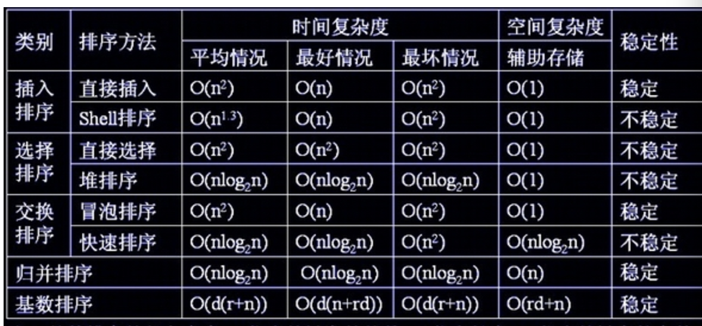

# 一些排序

时间复杂度记忆-  
 
冒泡、选择、直接 排序需要两个for循环，每次只关注一个元素，平均时间复杂度为O（n2）O（n2）（一遍找元素O(n)，一遍找位置O(n)） 

快速、归并、希尔、堆基于二分思想，log以2为底，平均时间复杂度为O(nlogn)（一遍找元素O(n)，一遍找位置O(logn)）
 
稳定性记忆-“快希选堆”（快牺牲稳定性）  

排序算法的稳定性：排序前后相同元素的相对位置不变，则称排序算法是稳定的；否则排序算法是不稳定的。
 

- 冒泡
    每次遍历将当前与后一个比较, 把最大(或最小)一直交换到最后, 然后进行下一趟
    优化: 增加标志位, 记录最后一次发生交换的位置, 下一次遍历到此就可以了

- 直插
    分为有序和无序区, 每次将无序区第一个元素插入到有序区对应位置

- 二分
    在直插基础上, 用二分法去查找插入位置

- 希尔

- 快速
    以第一个元素为基准, 小的放左, 大的防右, 递归左和右

- 选择
    跟直插有点像, 只是先选择无序区的最小的放在第一位, 然后无序区长度减一

- 归并
    拆分子序列, 再两两合并

    
